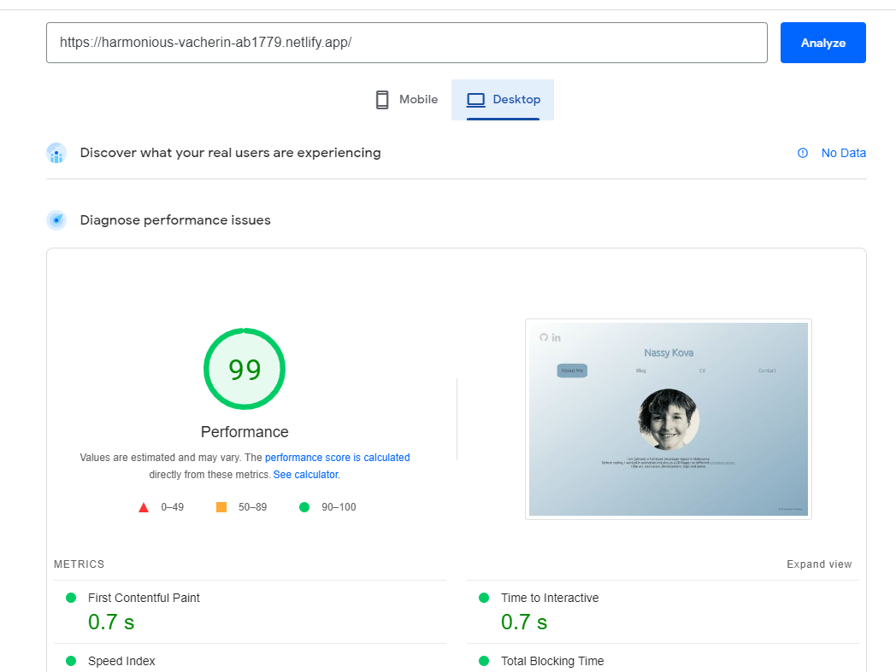
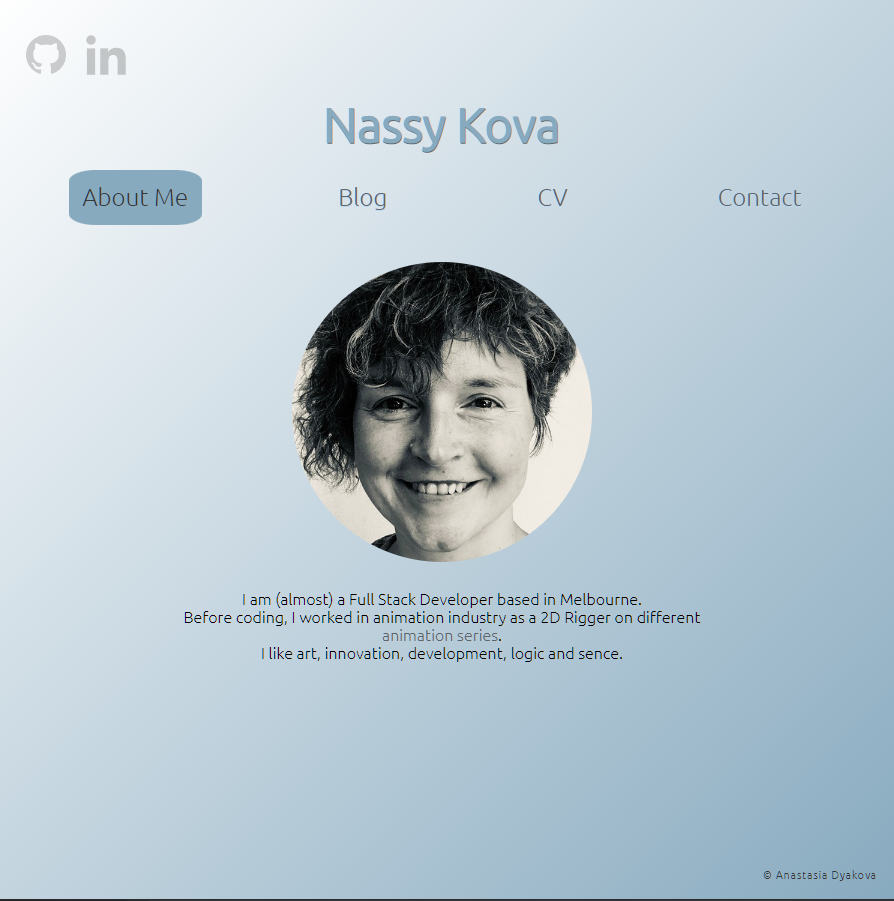

# Portfolio Website

## Website URL
[Website Link](https://harmonious-vacherin-ab1779.netlify.app/)

[GitHub Repository is here](https://github.com/purplebus/portfolio)

## Purpose
This website is a first assesment at __Coder Acedemy__.

Website contains information about my skills, current CV, social links

## Functionality / features

### Overview
The site has 9 pages. 4 main pages and 5 blog pages

### Components
- Each page has a **navigation bar**. There are links to social media, name of the site and the main menu. on the smalller screens the main menu changes to sandwich menu.
- Each page also has a **footer** with the copyright.
- **Graphical contant** presents in the social icons section, About Me section, Blog page and Blog Pages1-5
- Blog Pages 1-5 have a **comment section** under the post with text area and submit button.
- **Contact page** contains the form with text area and submit button.

### Features
- Color pallet is light and not dominant 
- Font "Ububtu" 
- Active page link has background color to help with navigation 
- Blog page has 5 blog post, each one is a link. Image in the post is chanhing when hovered  
- Social icons change the color and move when hovered 
- CV can be download as PDF file 

### Wireframes
#### Desktop version

#### Tablet Version

#### Mobile Version

## Target Audience
Potentual employers, tech communities

## Tech Stack
- _Planning stage:_ Trello
- _Code:_ HTML, SASS/SCC
- _Version Control:_ GitHub
- _Code Editor:_ VSC
- _Deployment:_ Netlify
- _Lighthouse Performance:_

## Screenshots

### Trello Board

### Desktop screenshots

**About Me** 

**Blog** 

**Blog Post** 

**CV** 

**Contact Me** 

### Tablet Version

**About Me** 

**Blog** 

**Blog Post** 

**CV** 

**Contact Me** 

### Mobile Version

**About Me** 

**Blog** 

**Blog Post** 

**CV** 

**Contact Me** 

